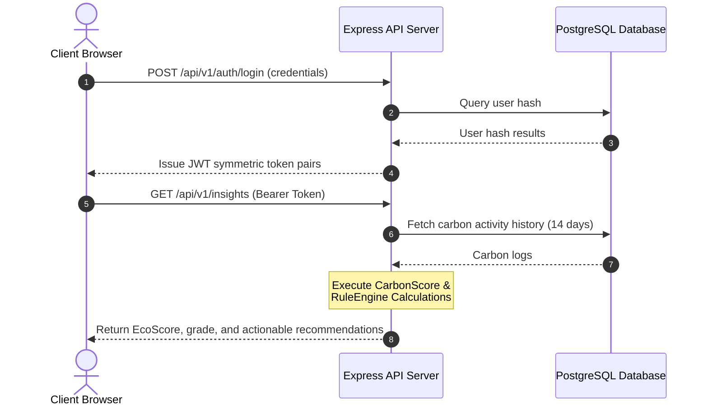

# 🌍 EcoTrack — Carbon Footprint Tracking & Analytics Platform

[](https://react.dev)
[](https://nodejs.org)
[](https://www.postgresql.org)
[](LICENSE)

EcoTrack is a production-grade, full-stack application designed to help individuals monitor, measure, and minimize their carbon footprint. Featuring clean data visualization dashboards, custom carbon scoring based on IPCC global standards, and intelligent recommendations engines.

---

## 🚀 Key Features

* **Real-time Carbon Analytics:** Glassmorphic dashboard charting weekly and monthly carbon footprints using dynamic SVG charts.
* **IPCC-Aligned Carbon Scoring:** Algorithm benchmarks user data against the 1.5°C Paris Agreement limit ($38.5\text{ kg CO}_2\text{e}$ weekly), generating a letter grade (A–D) and a score out of 100.
* **Intelligent Recommendation Engine:** Implements a Strategy design pattern triggering context-specific tips across transportation, energy, and diet segments.
* **Security & Defense-in-depth:** Express security middleware utilizing Helmet security headers, whitelisted CORS setups, rate-limiting, and parameterized database queries.
* **Extensible AI Architecture:** Configured with hook interfaces for transition from static rule-based structures to LLM Generative AI recommendations using Gemini Pro models.

---

## 🛠️ Tech Stack

* **Frontend:** React (Vite, React Router v7, Vanilla CSS, Recharts for analytics visualization, Lucide React icons).
* **Backend:** Node.js (Express, Winston/Morgan logging, Joi validators).
* **Database:** Serverless PostgreSQL (Neon.tech pooler, pg client).
* **Security:** Helmet, CORS, Express-rate-limit, Bcryptjs (cost factor 12), JWT (symmetric token pairs).

---

## 🏛️ System Architecture



---

## 📦 Project Structure

```text
EcoTrack/
├── client/              # React (Vite) frontend application
│   ├── src/components/  # Reusable UI cards, charts, and navigation
│   ├── src/pages/       # Auth pages, Dashboard, and AI Insights Page
│   └── src/services/    # Axios HTTP instance whitelisting 127.0.0.1
├── server/              # Express API backend application
│   ├── src/config/      # DB pools, logger, and Centralized config
│   ├── src/middleware/  # JWT validation, CORS, Rate Limiters, error handlers
│   ├── src/models/      # Parameterized query database interfaces
│   └── src/services/    # CarbonScore piecewise algorithms, Recommendation Engine
└── database/            # DDL Migrations & DML Seeding scripts
```

---

## 💻 Installation & Setup

### Prerequisites
* Node.js (v18+)
* PostgreSQL instance (e.g., Neon serverless DB)

### Step 1: Clone and Install Dependencies
Navigate into each folder individually to install packages:

```bash
# Clone the repository
git clone https://github.com/vansh-shende/EcoTrack.git
cd EcoTrack

# Install server dependencies
cd server
npm install

# Install client dependencies
cd ../client
npm install
```

### Step 2: Database Initialization
1. Copy the environment configuration template in the `server` folder:
   ```bash
   cp .env.example .env
   ```
2. Open `.env` and enter your connection parameters (`DB_HOST`, `DB_USER`, `DB_PASSWORD`).
3. Execute migrations and seed initial historical logs:
   ```bash
   npm run db:migrate
   npm run db:seed
   ```

### Step 3: Launch Local Servers
Run the backend and frontend services in separate terminal windows:

* **Terminal 1 (Backend):**
  ```bash
  cd server
  npm run dev
  ```
* **Terminal 2 (Frontend):**
  ```bash
  cd client
  npm run dev
  ```
The client application will launch on `http://localhost:5173`.

---

## 🔑 Environment Variables

### Backend (`server/.env`)
```bash
NODE_ENV=development
PORT=5000
API_PREFIX=/api/v1

DB_HOST=127.0.0.1
DB_PORT=5432
DB_NAME=ecotrack_dev
DB_USER=postgres
DB_PASSWORD=secretpassword
DB_SSL=false

CORS_ORIGIN=http://localhost:5173
JWT_SECRET=dev_access_token_secret_key
JWT_REFRESH_SECRET=dev_refresh_token_secret_key
```

### Frontend (`client/.env`)
```bash
VITE_ENV=development
VITE_API_URL=http://127.0.0.1:5000/api/v1
```

---

## 📖 API Documentation (v1)

### Authentication Endpoints
* `POST /api/v1/auth/register` — Create a new profile.
* `POST /api/v1/auth/login` — Authenticate and receive JWT token pairs.
* `POST /api/v1/auth/refresh-token` — Renew expired access tokens.

### Carbon Log Endpoints
* `GET /api/v1/emissions` — List paginated history of carbon records.
* `POST /api/v1/emissions` — Log a new emission activity.
* `DELETE /api/v1/emissions/:id` — Delete a log record.

### Dashboard & Analytics
* `GET /api/v1/dashboard/summary` — Retrieve aggregated emission metrics.
* `GET /api/v1/dashboard/breakdown` — Fetch category breakdown percentages.
* `GET /api/v1/insights` — Calculate EcoScore and return actionable recommendations.

---

## 🚀 Deployment Guide

1. **Database:** Deploy PostgreSQL schemas to **Neon.tech**.
2. **Backend:** Deploy the Node/Express container to **Render** or **Railway**. Configure the `CORS_ORIGIN` environmental variable to point to your frontend domain.
3. **Frontend:** Deploy the Vite static package to **Vercel**. Set `VITE_API_URL` pointing to your deployed API server endpoint.

---

## 🔮 Future Improvements

1. **Active Gemini LLM Integration:** Transition the recommendation logic from static rule engines to full LLM generation by providing structured carbon metrics as context templates.
2. **Third-Party Integrations:** Integrate with smart meters and utility provider APIs (e.g., Octopus Energy, Nest) to automate household carbon tracking.
3. **Social leaderboard:** Add multiplayer leagues and badges to incentivize community-wide footprints reduction.
